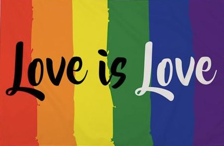

# Sentiment_analysis

# Problem statement

Love knows no gender and the LGBTQ (Lesbian, Gay, Bisexual, Transgender, and Queer) community is the epitome of this thought. In honor of Pride Month, we are here with another Machine Learning challenge, in association with Pride Circle, to celebrate the impact and changes that they made globally.

You have been appointed as a social media moderator for your firm. Your key responsibility is to tag and categorize quotes that are uploaded during Pride Month on the basis of its sentiment—positive, negative, and random. Your task is to build a sophisticated Machine Learning model combining Optical Character Recognition (OCR) and Natural Language Processing (NLP) to assess sentiments of these quotes.

# Dataset

The dataset consists of quotes that are uploaded during Pride Month.

The benefits of practicing this problem by using unsupervised Machine Learning techniques are as follows:

This challenge encourages you to apply your unsupervised Machine Learning skills to build models that can assess sentiments of a quote.
This challenge helps you enhance your knowledge of OCR and NLP that are a part of the advanced fields of Machine Learning and artificial intelligence.
You are required to build a model that analyzes sentiments of a quote and classifies them into positive, negative, or random.

Data description

| Column name |	Description |
| ----------- | ----------- |
| Filename	| File name of test data image |
| Category	| Target column [values: 'Positive'/'Negative'/'Random']|

# Evaluation criteria

**score = 100 * recall_score(actual_values, predicted_values)**

[Inspiration](https://www.hackerearth.com/challenges/competitive/hackerearth-machine-learning-challenge-pride-month-edition/)

# My Approach

**Pytesseract** is wonderful tool for extracting text from images having more option to play around with background color , rotation , resizing feature to improve the precision. Extracted Text is Analyized and for given problem set we have limitation with training samples which gives us the need to use **Naive Bayes** model for classifying sentiments into categorized Label.

